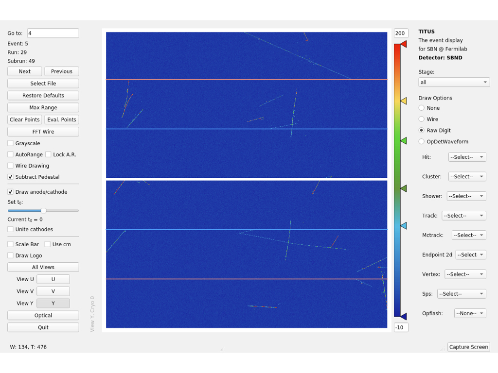
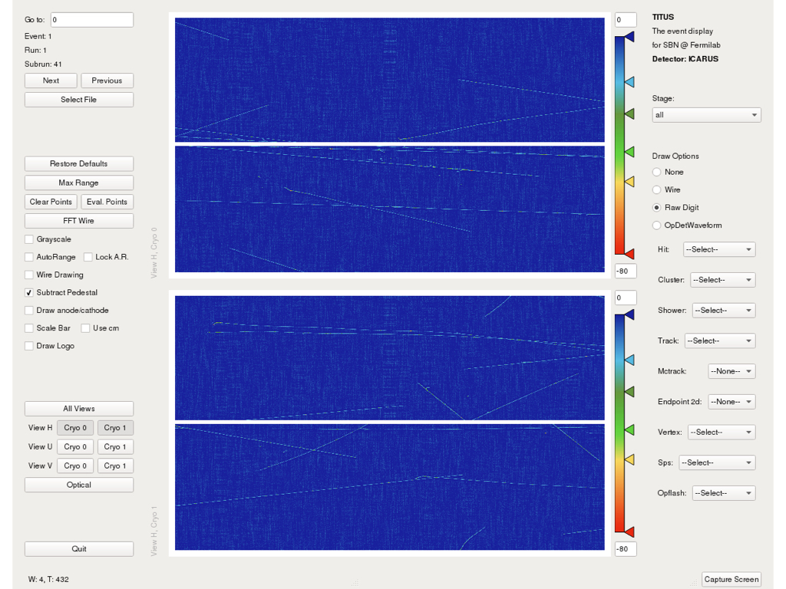
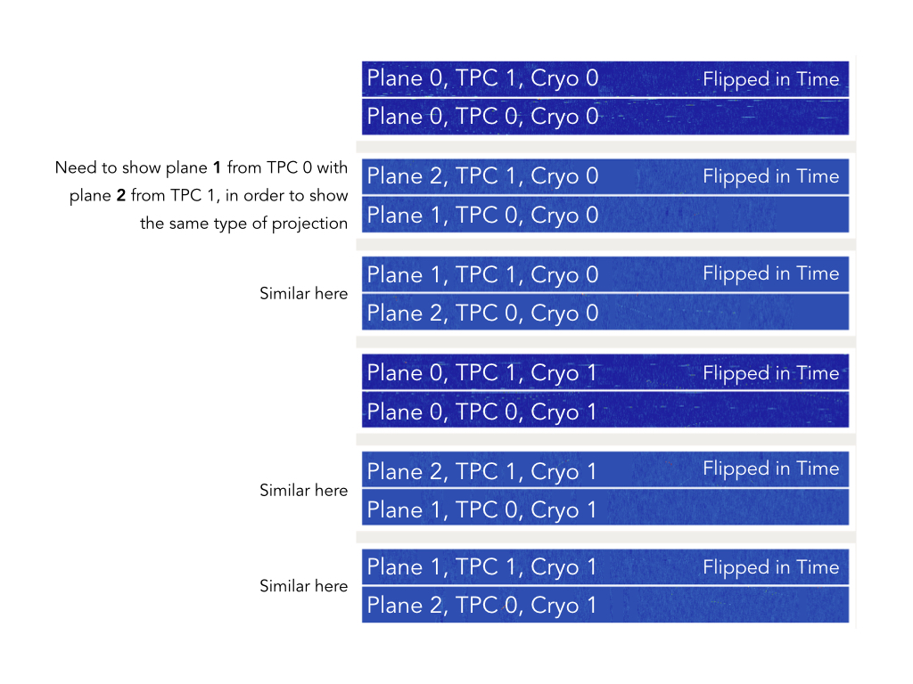

# Gallery Framework

## What is this?

This is a light framework that interfaces with gallery to read art-root files.  You have probably used larlite, which gives a light framework for reading and writing larlite format root files.  Gallery is a system to read art-root files, but doesn't provide any of the other useful tools you're used to.  You have to write your own event loop, build your code yourself, make sure to get all the linked libraries correct, etc.

This framework tries to help with that.  It interfaces with gallery to provide a larlite-style interface.  You write classes that extend from ana_base.h, just like in larlite.  Instead of receiving storage_manager, you receive gallery::Event.  You still have access to a lot of tools from larlite like GeometryHelper and LArUtils in general.

## TITUS Event Display

This framework contains TITUS: the event display for SBND at Fermilab. TITUS allows to visualize both raw and reconstructed data in 2D and 3D from the all the detectors in SBN program: SBND, MicroBooNE and ICARUS.

### TITUS for SBND

### TITUS for ICARUS

## Requirements

1) You need gallery.  For right now, that requires ups products, which means it uses it's own gcc/python/root and not the ones on your laptop.  If you are on the gpvms, getting gallery is super simple.  On your laptop, visit scisoft.fnal.gov to get gallery.

2) You need larsoft data products: nusimdata, larcoreobj, lardataobj.  If you get gallery via ups, get these via ups too.

3) We're working on a way to build gallery and larsoftobj systems without ups, using your own gcc and such.  This will come out later.

4) If you want to have the display you'll need numpy and PyQt.  You can get numpy and qt5 through scisoft and ups as well.  PyQt5 you can install once qt5 is built and ready, just make sure to install it to the ups python area.

## How to build and install the framework

1) Create a build directory: `mkdir gallery_framework_build && cd gallery_framework_build`

2) Run `cmake`: `cmake /path/to/gallery-framework`

3) Compile with `cmake --build .`

4) Make sure libraries are in your `$LD_LIBRARY_PATH`: `export LD_LIBRARY_PATH=$(pwd)/lib:$LD_LIBRARY_PATH`

## How to build and run the event display

1) Make sure the framework is built.

2) Make sure you have a working Python environment with `PyQt5`

3) Go to the `UserDev/EventDisplay/python` directory

4) Run with `evd.py /path/to/art-root-file.root`

(planned, coming soon) Install TITUS Python library: From `UserDev/EventDisplay/python`, do `pip install .`. Now you can write your own `evd.py` or copy the example and run from anywhere
